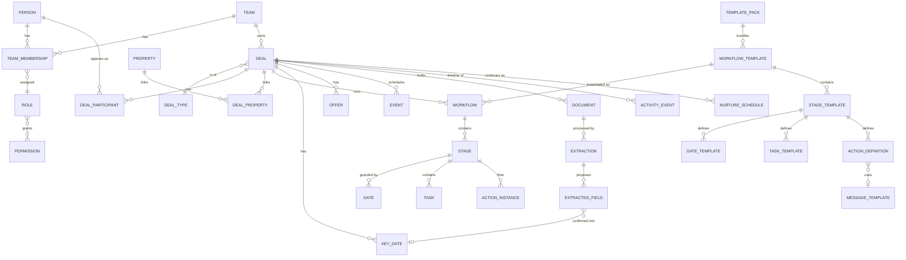

# Product Requirements Document

> [!info] Document status
> **Draft v0.5**, last revised 2026-08-22.
>
> Sources: [[The basic idea]] (Ian's originating brain dump), [[Rough data model.canvas]], and [[Conversation with Emily and Heather]] (2026-08-20 working session).
>
> **v0.2** folded in the Emily and Heather session, which answered seven of the ten open questions from v0.1 and added four material features absent from the first draft.
>
> **v0.3** applies the terminology set by [[Information Architecture]]. No scope changed. Every occurrence of *Project* became *Deal*, every *Milestone* became *Stage*, and *Milestone* was reassigned to a narrower meaning. Feature IDs (F1.1, F4.8, and so on) are unchanged and remain the stable references used by [[Screen Inventory]].
>
> **v0.4** records what slice 1 settled. Three open questions closed — shared person records (Q7), Vendor as a flag rather than a status, and whether a team's data export carries document *files* — and the `users` table became `people`, which §6.2 had described all along. No scope changed.
>
> **v0.5** replaces the `Brawling Mahogany` codename with the working name **Goldieflow**. Documentation only. No scope changed and no feature IDs changed. Infrastructure identifiers — containers, volumes, the test database, the staging path, the repository — still carry the old codename on purpose; see `CLAUDE.md`.
>
> Everything decided is listed in [[#15. Decision Log]].

> [!warning] Read this first: what the customer said that the v0.1 draft got wrong
> The 2026-08-20 session produced three findings that contradict v0.1. All three are now reflected below, but they are worth stating plainly because they change what gets built.
>
> 1. **The client portal matters far less than assumed.** Emily called the client interface something that "doesn't matter at all." Heather went further and said she does not want clients checking items off a list, because chasing a client through a to-do list reads as less professional than a phone call, not more. The portal is now a **read-only status page**, not an interactive workspace.
> 2. **AI document extraction is the competitor's headline feature and the one Emily rated highest.** It was entirely absent from v0.1. It is now in scope, deliberately sequenced last, and it collides directly with finding 3.
> 3. **Document upload carries real PII exposure that Emily raised unprompted.** Earnest money checks carry account numbers. Lending packets carry more. Emily's brokerage now requires a clause in the listing agreement disclosing who has access to client information. This constrains both the document feature and the AI feature.

> [!abstract] Terminology, and where it comes from
> [[Information Architecture]] is the naming authority for this project. Where it and this document ever disagree, it wins and this document gets corrected.
>
> Two distinctions matter while reading:
>
> - **A Stage is a period.** You are in it for days or weeks, and it holds tasks, gates, and automations. "Under Contract" is a stage.
> - **A Milestone is a moment.** It marks the completion of a stage significant enough to tell somebody about. "Property Listed" is a milestone. Not every stage is one.
>
> Code names and display labels also differ in a few places, deliberately. `key_dates` displays as **Dates & Deadlines**, which is Emily's own phrase. `action_definitions` displays as **Automation**. `nurture_schedules` displays as **Keep in Touch**. The full mapping is in the IA document's three-vocabulary table.

---

## 1. Overview

**Goldieflow** (working name) is a multi-tenant web application that runs the *process* side of a residential real estate practice.

Most tools in this space are contact databases with a task list bolted on. The bet here is different. The unit of value is not the contact record, it is the **workflow**: a repeatable, gated sequence of stages that every deal of a given type must pass through, with the right communication firing automatically at each step.

That bet was directly validated on 2026-08-20. Heather, describing the gap in their current tooling: CTM "states the deadline, it doesn't give you the other, like, *check, send this now*." Emily, independently: "You can customize your task list, and that's what we don't have anywhere." Two working practitioners named the same missing thing without prompting, and it is the thing this product is built around.

### 1.1 Positioning

This is a **workflow and client-communication layer**, not a system of record. That distinction is now confirmed rather than assumed. Emily's practice runs on **CTM eContracts** (a Colorado standard, now an MRI Software product) for contracts and signatures. They do not use DocuSign. Executed documents live in CTM, which carries the security obligation along with them. Emily on storing an earnest money check: "We can keep that in CTM because CTM has security. It's also not ours."

Goldieflow sits alongside CTM and the MLS and answers three questions better than either does:

1. What has to happen next on this deal, and who owes it?
2. Has the client been told?
3. Can I prove the process was followed?

### 1.2 Competitive context

The category is crowded at the brokerage tier (SkySlope, Dotloop, Lone Wolf, Brivity, Rechat) and thin at the solo and micro-team tier. v0.1 treated that gap as unproven. The 2026-08-20 session changed the picture.

**The direct competitor.** Emily and Heather attended a demo by a husband-and-wife team building almost exactly this product. Relevant facts:

| Observation | Implication |
|---|---|
| Priced at **$200 per month**, with paying customers | The v0.1 working assumption of $40 per month was low by 5x. Willingness to pay at this tier is higher than assumed. |
| Customizable per-stage task lists (pre-listing, signed listing, under contract, during inspection) | Confirms the core thesis, and confirms it is the thing agents notice. |
| AI extracts dates and additional provisions from an uploaded contract PDF | Their workaround for having no CTM integration. See [[#4.10 AI Document Intelligence]]. |
| AI converts an uploaded inspection report into a task list | Emily: "One of my favorite things that it did." |
| Prompts agents with local events and social life events as touchpoint opportunities | Emily and Heather both independently called this the smartest feature in the demo. |
| **No mobile app, no push notifications** | Emily flagged this as a real gap. It is why native mobile is no longer a flat non-goal. |
| Does not import contacts from a CRM, Google, or phone contacts | Emily flagged this as an obvious miss. Contact import is now in scope. |
| Requires uploading an MLS sheet rather than linking | Emily flagged this as clumsy. Our link-only approach is constrained by IDX licensing, not preference. See [[#10. Compliance and Legal Considerations]]. |
| Their next planned phase is a client-facing view | Emily explicitly disagrees with that priority. So do we now. |
| Onboarding is high-touch: they sit with the customer and load their task lists | Realistic. It also undercuts the v0.1 goal of zero-support onboarding. |
| Presentation quality was poor; the technical half of the team did not read as an engineer | Emily: "I could have crushed that." |

**The honest read.** The wedge is not a feature nobody has thought of. Someone is already selling this at $200 a month and finding buyers. The wedge is execution, credibility, and distribution. That is a real business, but it is a different business from "we found an unserved niche," and the plan should stop pretending otherwise.

**Heather's comparison point** was Rechat, which she felt the competitor resembled. Her stated difference: with the competitor "you own your CRM," and you can customize dates, deadlines, and task lists. Worth a direct look at Rechat before finalizing positioning.

---

## 2. Goals and Non-Goals

### 2.1 Goals

| # | Goal | Why it matters |
|---|---|---|
| G1 | Encode a real estate deal process as a reusable, gated workflow template | The core product thesis, now practitioner-validated |
| G2 | Make it impossible to silently skip a required step | Process discipline is the value |
| G3 | Fire client communication automatically at defined milestones | Removes the most common failure mode: client silence |
| G4 | Give clients a passive, read-only view of where their deal stands | Revised in v0.2. Reassurance without turning the client into a participant |
| G5 | Isolate every team's data completely from every other team's | Non-negotiable for a SaaS with financial and personal data |
| G6 | Get a new team productive inside one guided onboarding session | **Revised in v0.2.** The competitor onboards by sitting with the customer and loading their task lists, and that appears to be the market norm. Target a good guided setup, not zero-touch. |
| G7 | Keep the relationship alive after closing | **New in v0.2.** Emily: closed deals still have activity, and the tool "became a CRM." Past clients are an asset, not an archive. |
| G8 | Handle 25 concurrent active deals per team without the dashboard degrading | **New in v0.2.** Real observed volumes: one colleague at 23, another at 17, Emily typically 2 to 10. Emily pushed for 25 over Ian's proposed 12. |

### 2.2 Non-Goals for v1

- Lead generation, paid advertising integrations, and cold drip campaigns. Note that **post-close relationship nurture is now in scope** and is a different thing. See [[#4.11 Post-Close CRM and Nurture]].
- E-signature. **Confirmed unnecessary.** Emily's market signs through CTM, not DocuSign.
- **Client-initiated document upload.** Confirmed unnecessary. Emily: "That's actually not common. Most clients do all their documentation through CTM." Reopen only if the product is sold outside Colorado.
- Accounting, commission splits, or brokerage payroll
- MLS listing data ingestion or IDX display
- **Commercial transactions.** Deferred to a later template pack. Emily initially argued commercial is transferable if task lists are fully customizable, then conceded she does not know commercial workflows well enough to specify them.
- **Ongoing rental and property management.** Confirmed out, and for a licensing reason rather than a scope reason: Emily's brokerage does not manage rentals and "a lot of us aren't allowed to." **Tenant placement** remains in scope as a template pack.
- Native iOS and Android apps. **Superseded in v0.2 by a PWA with web push.** See [[#4.12 Mobile and Notifications]].
- Subscription billing and self-serve signup, deferred to slice 6

---

## 3. Target Users and Personas

### 3.1 Emily, the Team Owner / Agent

Licensed Colorado agent, runs both buyer-side and seller-side deals. Owns the client relationship and the outcome. Typically runs 2 to 10 active deals, has run 10 at once, currently around 3.

**Needs:** a single screen showing every live deal and what is late. Confidence that clients are being communicated with while she is out showing property. The ability to change her process once and have it apply going forward. Her contacts imported rather than retyped.

**Frustrations to solve:** repeating the same instructions to her assistant. Discovering a week late that a disclosure never went out. Being asked "what's happening with my house?" and not knowing without digging. Her current tooling gives her deadlines with no attached actions.

**Technical comfort:** moderate. Will not read documentation. Commercially sharp: she assessed a competitor's product, pricing, presentation quality, and roadmap in a single sitting and identified their two weakest points.

**Watch for:** Emily believes the build is more straightforward than it is ("I don't think it's that hard, I know I'm minimizing"). Ian believes otherwise. That gap needs managing before it becomes a disagreement about timelines. See [[#14.3 Risks]].

### 3.2 Heather, the Assistant / Transaction Coordinator

Executes the process. Books the photographer, orders the sign, chases the inspector, checks the lockbox, sends the paperwork.

**Needs:** an unambiguous, ordered work queue across all deals. To know what is blocking each stage. To log a call in two clicks. Everything in one place rather than split between notes, checklists, and CTM.

**Frustrations to solve:** holding a dozen deals in her head. Reconstructing what was already done. Her own words on the current state: you go "through your notes and having to do your checklist."

**This persona is the primary daily user.** If Heather does not adopt it, the product fails regardless of what Emily thinks. She has already supplied her own task list, which is a strong adoption signal.

**Note her opinion on clients:** she does not want clients checking things off. She sees direct agent contact as the more professional move. That view now shapes [[#4.7 Client Status Page]].

### 3.3 The Client (Seller or Buyer)

A homeowner or homebuyer, once every seven years, in the middle of the largest transaction of their life.

**Needs:** to know where things stand without feeling like a nuisance for asking. Reassurance more than data.

**What they explicitly do not need,** per both practitioners: tasks assigned to them, checkboxes, or a workspace. They sign in CTM and they talk to their agent. Anything this product shows them is supplementary.

**Technical comfort:** unknown and highly variable. Must work on a phone, first try, no password.

### 3.4 The Past Client

**New in v0.2.** A closed deal is not a dead record. Emily observed that in the competitor's product, closed contracts still generate activity, and that a team might hold a hundred past clients receiving automated touchpoints. Home anniversary notes, neighborhood news, life events.

**Needs from the team:** to be remembered without being marketed at.

**Implication:** the system holds far more past clients than active deals. Design the data model and the dashboard accordingly. Twenty-five active deals, hundreds of past ones.

### 3.5 The Service Provider

Hired repeatedly across deals. Does not need an account. The team needs to know what this vendor is good at, what they charge, when they were last used, and whether they were any good.

### 3.6 The Super Administrator (Ian)

Platform operator. Needs cross-tenant visibility for support, plus an audit trail proving that access was appropriate.

---

## 4. Key Features and Functionality

### 4.1 Teams and Tenancy

| ID | Feature | Description | Priority |
|---|---|---|---|
| F1.1 | Team as tenant boundary | Every business record belongs to exactly one team. Queries are team-scoped at the framework level, not per-controller. | Must |
| F1.2 | Team control panel | Team profile, branding, sending identity, members, roles, templates. | Must |
| F1.3 | Membership and invitations | Invite by email, assign role on invite, revoke without destroying historical attribution. **The invitation is never email-only** (§8.5.1): the invitee can accept it in-app, and the inviter or a platform operator can hand the link over directly. | Must |
| F1.4 | Multi-team users | One person, several memberships, context switching. Notes stay scoped to the recording team. | Should |
| F1.5 | Super admin console | Cross-team lookup, impersonation with a logged reason, tenant provisioning. | Must |

### 4.2 People, Contacts, and Roles

| ID | Feature | Description | Priority |
|---|---|---|---|
| F2.1 | Single person record | One record per human, login credentials optional. | Must |
| F2.2 | Access roles | Super Administrator, Team Owner, Team Member, Status Viewer, Contact. Assigned **per team**. | Must |
| F2.3 | Custom roles and permissions | Team owner composes roles from the available permission set, scoped to their team. | Should |
| F2.4 | Contact lifecycle | Lead, Active, **Past Client**, Archived. Past Client is a first-class state that drives nurture, not an archive. | Must |
| F2.5 | Contact log | Timestamped touchpoints against a person and optionally a deal. | Must |
| F2.6 | Vendor directory | Specialty tags, typical cost, service area, rating, free-text history. Filterable. | Should |
| F2.7 | Role-specific fields | A role may contribute extra profile fields. | Should |
| F2.8 | **Contact import** | **New in v0.2.** CSV, Google Contacts, and vCard. Emily named the absence of this as an obvious failing in the competitor. Nobody retypes a client list. | Must |

### 4.3 Deals (Deals)

| ID | Feature | Description | Priority |
|---|---|---|---|
| F3.1 | Deal record | Belongs to a team, has a deal type, client participants, zero or more properties, one or more workflows. | Must |
| F3.2 | Auto-generated names | Derived from subject property address, falling back to client surname. Editable. | Should |
| F3.3 | Deal participants | Per-deal roles: Seller, Buyer, Co-Agent, Opposing Agent, Lender, Title/Escrow, Inspector, Appraiser, Stager, Photographer, Contractor, Attorney, Other. | Must |
| F3.4 | Properties | Address, parcel, type, status, notes, media, labelled external links (MLS, Zillow, assessor). Linked as **subject** or **candidate**. | Must |
| F3.5 | Candidate property tracking | Buyer-side: per-property interest status. | Should |
| F3.6 | Offers | Amount, terms, contingencies, key dates, status. | Should |
| F3.7 | Deal overview | Current stage, what blocks advance, upcoming key dates, recent activity, participants, documents. | Must |
| F3.8 | **Post-close continuation** | **New in v0.2.** Closing does not terminate a deal. It transitions to a closed state that keeps the participants and hands them to the nurture system. | Must |

### 4.4 Workflow Engine

The heart of the product and the bulk of the engineering.

| ID | Feature | Description | Priority |
|---|---|---|---|
| F4.1 | Workflow templates | Reusable, named, versioned, team-owned, associated with deal types. | Must |
| F4.2 | Seeded template library | Ship working templates for the phases Emily and Heather actually use: **pre-listing, signed listing, under contract, inspection, closing**, plus buyer-side equivalents. Source material is Emily's and Heather's own lists. | Must |
| F4.3 | Stage templates | Ordered steps carrying expected duration, owner role, tasks, gates, actions. | Must |
| F4.4 | Template editing (clone and modify) | Duplicate a seeded template, then rename, reorder, add, and remove stages and tasks freely. No blank-canvas builder in v1. | Must |
| F4.5 | Versioning with instance snapshots | Instantiating copies the template. Later edits never rewrite an in-flight deal. | Must |
| F4.6 | Workflow instances | A live copy on a deal, with state, current stage, planned and actual dates. | Must |
| F4.7 | Multiple workflows per deal | Pre-listing improvements and the sale itself can run concurrently. | Must |
| F4.8 | Gated advancement (FSM) | Cannot advance until blocking gates clear. | Must |
| F4.9 | Override with reason | Bypass permission holders can force-advance. Typed reason required, immutable audit entry written, visible marker on the timeline, follow-up task auto-created. | Must |
| F4.10 | Tasks | Assignable, due-dated work under a stage. A task is work owed; a gate is a condition on advancement. | Must |
| F4.11 | Notes | Internal by default, with an explicit client-visible toggle. | Must |
| F4.12 | Skip and reopen | With audit entries. | Should |
| F4.13 | **Template packs** | **New in v0.2.** Templates ship as named, installable bundles: Listing, Buyer, Rental Placement, later Commercial. Emily's framing, and a natural packaging and pricing unit. Emily's read on relative value: "the buyer's pack is way less than the listing. The listing is the most important part." | Should |

#### Stages and milestones

The rough data model called every step a milestone. But the thing it described holds tasks and gates and has a start and an end date, which makes it a period rather than a point. Emily and Heather talk in periods: pre-listing, signed listing, under contract, during inspection.

So the words now split. A **Stage** is the period. A **Milestone** is the moment a stage completes, when that completion is worth reporting.

| | Stage | Milestone |
|---|---|---|
| Nature | Duration | Point in time |
| Example | "Under Contract" | "Property Listed" |
| Holds tasks and gates | Yes | No |
| Dates | Start and end | One |
| Client sees it as | A step on the timeline | An event |
| Triggers client email | Sometimes | Usually |

**Implementation cost is one boolean and one string.** A milestone is not a separate table. It is `stages.is_milestone`, plus `stages.milestone_label` carrying the client-facing wording for the moment. "Listing Preparation" is a stage and not a milestone. "Property Listed" is both.

#### Gate types

| Gate type | Clears when |
|---|---|
| Manual confirmation | A permitted user checks it off |
| Required tasks complete | All tasks flagged `required` on the stage are done |
| Document present | A document of a required category is attached |
| Field populated | A named field on the deal or property is non-empty |
| Action completed | A specific action instance fired successfully |
| Date reached | A named key date has passed |
| Approval | A specified role recorded approval |

Each gate is independently **blocking** or **advisory**.

#### States

- **Stage:** `pending` → `active` → `complete`, with side exits to `skipped` and `blocked`
- **Workflow:** `not_started` → `active` → `completed`, with side exits to `on_hold` and `cancelled`
- **Deal:** `active` → `closed` → `nurture`, with side exits to `fell_through` and `cancelled`

### 4.5 Actions and Automation

| ID | Feature | Description | Priority |
|---|---|---|---|
| F5.1 | Action definitions | Attached to stage templates. Trigger, type, configuration. | Must |
| F5.2 | Triggers | Stage start or completion, workflow start or completion, N days before or after a key date, gate clear, **and N days or years after closing** for nurture. | Must |
| F5.3 | Action types (v1) | Send email, create task, create calendar event, post internal notification, **send push notification**, prompt a manual action. | Must |
| F5.4 | Manual vs automatic | System-fired or presented to a human as a prompt. Recorded identically once done. | Must |
| F5.5 | Message templates | Team-owned, named, subject and body, merge fields, recipient rule by participant role. | Must |
| F5.6 | Merge fields | Client name, address, MLS link, agent contact block, stage, key dates, status page link. Validated at save time. | Must |
| F5.7 | Review before send | Per-action: send immediately, or queue for approval with an editable preview. Default to approval for a team's first 30 days. | Should |
| F5.8 | Delivery tracking | Sent, delivered, bounced, complained, opened. Bounces suppress and alert. | Must |
| F5.9 | Send safety rails | Per-team rate limit, hard "no sends" switch, sandbox mode redirecting to the team owner. | Must |
| F5.10 | **Auto-populated action emails** | **New in v0.2.** Reaching a milestone pre-fills the relevant outbound email with the right recipient and content, ready to review and send. Emily on the competitor: "it's time to schedule inspection, it auto populates the email." This is F5.5 plus F5.7 working together and is worth calling out as the visible behaviour agents actually notice. | Must |

> [!danger] The most dangerous feature in the product
> An automation that emails the wrong client the wrong thing damages a real relationship and cannot be recalled. F5.7 and F5.9 are launch blockers, not enhancements.

### 4.6 Documents

Materially narrowed in v0.2. Executed contracts live in CTM. This product holds working documents, and it must actively discourage anything else.

| ID | Feature | Description | Priority |
|---|---|---|---|
| F6.1 | Upload and attach | Files against a deal, property, or stage. | Must |
| F6.2 | Categories | Inspection report, disclosure, marketing, photo, receipt, correspondence, other. **Restricted categories are refused outright.** | Must |
| F6.3 | Visibility scope | Internal by default. Client-visible is explicit. | Must |
| F6.4 | Private storage, signed URLs | No public buckets. Every download authorized and short-lived. | Must |
| F6.5 | Property photo galleries | Ordered, captioned, with a primary image. | Should |
| F6.6 | **PII upload guardrails** | **New in v0.2.** A prominent, unmissable warning at every upload point instructing users not to upload financial instruments or lending packets. Executed contracts belong in CTM. | Must |
| F6.7 | **Sensitive content detection** | **New in v0.2.** Heuristic detection of bank routing and account number patterns, MICR lines, and check-like layouts, with the upload quarantined and refused. | Should |

> [!warning] The circularity Ian raised, and how it resolves
> Emily wanted the system to detect a check and refuse it. Ian's objection is correct: to know that a file is a check, the system must already have received and analysed it. There is no way around that, so the design must instead **minimise the window**: scan in memory on receipt, refuse and discard before anything is written to permanent storage, log the rejection without retaining the file, and never send a refused document to any third-party AI service. That is the honest best available, and it should be described accurately in the terms rather than oversold.

### 4.7 Client Status Page

**Substantially reduced in v0.2**, on direct customer feedback. This is a read-only reassurance surface, not a workspace. Emily: the client interface "doesn't matter at all." Heather: "I don't want my client checking off a to-do list."

| ID | Feature | Description | Priority |
|---|---|---|---|
| F7.1 | Magic-link access | Signed, expiring, single-use. No password. | Must |
| F7.2 | Timeline view | Jargon-free progress: done, current, next, roughly when. | Must |
| F7.3 | ~~Client-visible tasks~~ | **Cut.** Clients are not assigned work and do not check things off. | Cut |
| F7.4 | Client-visible documents | Download only, for anything explicitly scoped client-visible. | Should |
| F7.5 | Team branding | The team's logo, colors, and agent contact block. | Should |
| F7.6 | Contact the team | A prominent "call or email your agent" block. **Not** a messaging system, per Heather's professionalism point. | Should |
| F7.7 | Opaque URLs | ULIDs only in client-facing routes. | Must |
| F7.8 | ~~Client uploads~~ | **Cut.** Confirmed unnecessary: clients sign and return through CTM. | Cut |

### 4.8 Calendar and Key Dates

| ID | Feature | Description | Priority |
|---|---|---|---|
| F8.1 | Events | Showings, open houses, inspections, appraisals, closings, contractor visits. | Must |
| F8.2 | Key dates and contingency calendar | Named, legally significant dates with derived calculation and downstream recalculation when an anchor moves. **Now the destination for AI contract extraction.** | Must |
| F8.3 | Tokenised iCal feed (read-only) | Per-user and per-deal. Works everywhere, no OAuth. The v1 approach. | Must |
| F8.4 | Deadline reminders | Scheduled notifications, emails, and push ahead of key dates. | Must |
| F8.5 | Two-way Google Calendar sync | Deferred past v1. | Could |

### 4.9 Dashboards, Search, and Reporting

| ID | Feature | Description | Priority |
|---|---|---|---|
| F9.1 | Team dashboard | **Designed for 25 concurrent active deals.** Current stage per deal, blocked deals, overdue tasks, key dates in the next 14 days, recent activity. | Must |
| F9.2 | My work queue | Every task assigned to me across all deals, ordered by urgency. Heather's primary screen. | Must |
| F9.3 | Global search | People, deals, properties, documents. Team-scoped. | Should |
| F9.4 | Activity timeline | Unified, chronological, filterable per deal. | Must |
| F9.5 | Past client view | **New in v0.2.** A separate surface for hundreds of closed relationships, distinct from the active deal dashboard. | Should |
| F9.6 | Process reporting | Average days per stage, most-overridden gates, automation failure rate. | Could |

### 4.10 AI Document Intelligence

**New in v0.2.** The competitor's headline capability and the feature Emily rated highest. Sequenced last in v1, deliberately: the workflow engine must work with manual entry before extraction is layered on as an accelerator.

| ID | Feature | Description | Priority |
|---|---|---|---|
| F10.1 | Contract date extraction | Upload an executed contract PDF. Extract every date and deadline into `key_dates`, and capture additional provisions as notes. | Must (slice 5) |
| F10.2 | **Mandatory human review** | Every extracted date lands in a review screen showing the value, its confidence, and the source page. Nothing enters the contingency calendar unconfirmed. A missed inspection deadline has legal consequences and an unreviewed model output must never cause one. | Must (slice 5) |
| F10.3 | Inspection report to task list | Upload an inspection report, generate a proposed task list, agent accepts or edits before anything is created. | Must (slice 5) |
| F10.4 | Extraction audit record | Store the source document reference, model and version, prompt version, raw output, confidence, and what the human changed. | Must (slice 5) |
| F10.5 | Redaction before processing | Strip or mask detected financial identifiers before any document leaves for a third-party model. | Must (slice 5) |
| F10.6 | Provider abstraction | Extraction sits behind an interface so the model provider can change without touching the workflow engine. | Should |

> [!note] Why this is the CTM integration strategy
> The competitor "doesn't have to sync with CTM" precisely because they cannot. CTM eContracts belongs to MRI Software, and a two-person startup is not getting a data-sharing agreement out of a vendor that size. Extracting from the PDF the agent already has is the realistic path, and it works with any state's contract rather than only Colorado's.

> [!danger] The unresolved tension
> Emily wants AI extraction **and** wants to limit what the AI sees, and both instincts are right. Contracts contain exactly the personal financial information she is worried about. F10.5 narrows the exposure. It does not eliminate it. Before this slice ships, the following must exist: a signed data processing agreement with the model provider, a provider contractually barred from training on submitted content, and language in the team's own listing agreement covering third-party processing. Emily has already flagged that her brokerage requires such a clause.

### 4.11 Post-Close CRM and Nurture

**New in v0.2.** Emily: when the contract closes, activity continues, and the tool "became a CRM." Note the boundary carefully. This is retention of existing relationships, not lead generation, which remains a non-goal.

| ID | Feature | Description | Priority |
|---|---|---|---|
| F11.1 | Post-close transition | Closing moves a deal to a nurture state that retains participants and history. | Must |
| F11.2 | Anniversary reminders | Home anniversary and similar recurring touchpoints, prompted to the agent or sent automatically. | Should |
| F11.3 | Nurture cadence | Simple, low-frequency, per-past-client schedule. Deliberately not a drip campaign engine. | Should |
| F11.4 | Touchpoint prompts | Surfaces "you have not spoken to this person in N months" against the past client list. | Could |
| F11.5 | Local event prompts | Suggest a genuine reason to reach out: a neighborhood event near a past client's home. | Could (post-v1) |
| F11.6 | Social life-event prompts | Surface life events (a birth, a new job) as touchpoint opportunities. | Could (post-v1) |

> [!warning] On F11.5 and F11.6, which both practitioners loved
> Emily called the social life-event idea "genius" and nearly bought a product that did only that. Heather rated the local-events prompt the most important thing in the whole demo. So the demand is real, and it is worth saying plainly what is and is not achievable.
>
> **Local events (F11.5) are buildable.** Event APIs, municipal calendars, and local news feeds are legitimately available, and matching them to a stored client address is straightforward.
>
> **Social life-event monitoring (F11.6) is a different matter.** Scraping Facebook violates its terms of service, and Meta's APIs do not expose friends' life events to third-party applications. Any vendor marketing this is either scraping against terms, using data of uncertain provenance, or working from something far thinner than it sounds. Beyond the legality there is a positioning question: a tool that silently monitors clients' personal social accounts is a very different product from a transaction workflow tool, and it invites exactly the privacy scrutiny Emily is otherwise trying to avoid. **Recommendation: build F11.5, and treat F11.6 as out of scope pending a legal review that will most likely come back negative.**

### 4.12 Mobile and Notifications

**New in v0.2.** Emily identified the absence of an app and push notifications as a real gap in the competitor's product and said "app is the way to go."

| ID | Feature | Description | Priority |
|---|---|---|---|
| F12.1 | Installable PWA | Home screen install, app-like shell, offline-tolerant read of the work queue and today's deals. | Must |
| F12.2 | Web push notifications | Deadline reminders, task assignment, gate cleared, override performed, automation failure. Works on current iOS and Android. | Must |
| F12.3 | Mobile quick capture | Log a call, complete a task, add a note in a few taps from a car. | Should |
| F12.4 | Per-user notification preferences | Channel and quiet hours per event type. Nobody wants a 6am push. | Should |
| F12.5 | Native apps | Post-v1. The API layer should be designed so a native client can be added without rework. | Could |

---

## 5. User Flows

### 5.1 Onboarding a new team

Revised in v0.2 to reflect that guided onboarding is the market norm.

1. Ian provisions a team and invites the owner. The invitation is emailed; if it does not arrive, Ian copies the link from the team's page in the console, or Emily accepts it from inside the product if she already has an account (§8.5.1).
2. Emily sets a password, enables 2FA, completes the team profile: name, logo, colors, signature block.
3. She verifies a sending domain or accepts the shared default identity.
4. She invites Heather as a Team Member.
5. **She imports contacts** from Google or CSV.
6. She installs the Listing and Buyer template packs.
7. In a guided session, she and Ian walk her actual task lists into the templates: delete what does not apply, reorder, edit the client-facing emails into her voice.
8. She creates her first deal.

**Target: productive by the end of one guided session.**

### 5.2 Starting a seller-side deal

1. Heather clicks **New Deal**, chooses *Seller Representation*.
2. Adds the client as a *Seller* participant, from imported contacts or created inline.
3. Adds the subject property. Name auto-generates as "123 Main St".
4. Attaches the *Selling a Property* workflow. Instance records are created from the snapshot.
5. *Initial Consultation* activates. Its tasks appear in Heather's queue. Its welcome email queues for approval.
6. She reads and approves. It sends via SES. Timeline and delivery records are written.

### 5.3 Going under contract (slice 5, with extraction)

1. The deal is accepted. Heather uploads the executed contract PDF.
2. Extraction runs. She lands on a review screen: 11 proposed key dates, each with the source page and a confidence indicator, plus three captured additional provisions.
3. She corrects one misread date, confirms the rest, and discards one that is not relevant.
4. Confirmed dates populate the contingency calendar. Downstream derived dates recalculate.
5. The *Under Contract* workflow activates and its stage tasks appear.
6. Push notifications are scheduled ahead of each critical deadline.

### 5.4 Advancing a stage with a gate blocked

1. Heather opens the deal and clicks **Advance to Property Listed**.
2. Gates evaluate and refuse: *Document present: signed listing agreement* is unmet, and *Field populated: MLS link* is empty.
3. Each unmet gate links directly to the thing that clears it.
4. Gates clear. **Advance** enables.
5. On advance: the stage completes with an actual date, the next activates, actions fire (seller email with the MLS link, open house calendar event, sign and photography tasks), all written to the timeline.

### 5.5 Overriding a gate

1. Emily needs *Closing* but the appraisal has not landed.
2. She clicks **Advance**, sees the blocked gate, clicks **Override**.
3. A typed reason is required. "Appraisal received by email, uploading tomorrow."
4. The workflow advances. An immutable audit entry records who, when, which gate, and why. The timeline shows a distinct override marker. A follow-up task is created so the bypassed gate does not vanish.

### 5.6 Inspection (slice 5)

1. The inspection completes. Heather uploads the report.
2. Extraction proposes a task list from the findings.
3. She and Emily review, cut the trivia, keep the material items, and accept.
4. Tasks are created under the *Inspection* stage with owners and due dates derived from the objection deadline.

### 5.7 Client checking status

1. The seller receives a milestone email containing a status page link.
2. Clicking it validates a signed token. No password.
3. He sees a branded, read-only timeline: four steps complete, currently *Under Contract*, next *Inspection* with a date, plus his agent's phone number.
4. There is nothing for him to do here, which is the point. If he has a question he calls Emily.

### 5.8 Closing and afterwards

1. The closing stage completes. The deal moves to `closed`, then `nurture`.
2. Participants are retained. The seller becomes a **Past Client**.
3. A home anniversary touchpoint is scheduled for one year out.
4. Twelve months later, Emily gets a prompt with a suggested note. She edits and sends it.

### 5.9 Onboarding a vendor

1. Heather adds a service provider: name, contact, specialties, typical cost, service area.
2. No login is created.
3. She assigns him to a deal as *Stager*.
4. Later, filtering the directory by specialty surfaces him with his rating and history.

---

## 6. Data Model (Revised)

### 6.1 Core entity relationships

### 6.2 Entity reference

#### Tenancy and identity

| Entity | Key fields | Notes |
|---|---|---|
| `teams` | name, slug, logo, brand colors, sending identity, timezone, settings JSON | The tenant boundary. Every business table carries `team_id`. |
| `people` | ulid, names, email, phone, password (nullable), 2FA secret, status, timestamps | One record per human. Credentials optional. |
| `team_memberships` | team_id, person_id, status (lead/active/past_client/archived), joined_at, revoked_at, **private notes**, role fields JSON | Makes multi-team work. Team-private notes live here, not on the person. |
| `roles` | team_id (nullable for system roles), name, is_system | Access roles only. |
| `permissions` | key, group, description | Flat, seeded in code. |
| `role_permission`, `membership_role` | join tables | A person can hold several roles in one team. |

#### Deals

| Entity | Key fields | Notes |
|---|---|---|
| `deal_types` | team_id (nullable), name, side (buy/sell/rent/other) | Many deals share one type. |
| `deals` | team_id, deal_type_id, name, generated_name, state, opened_at, closed_at, transaction_value, notes | State includes `closed` and `nurture`. |
| `deal_participants` | deal_id, **team_membership_id**, participant_role, is_primary, notes | Per deal, not global. `team_membership_id` rather than `person_id` since #140 — see §7.2. |
| `properties` | team_id, street, unit, city, **state_code**, postal_code, parcel_number, **type**, **status**, beds, baths, sqft, year_built, notes | Team-owned, reusable across deals. Enum columns rather than `type_id`/`status_id` since #61 — see below. |
| `deal_properties` | team_id, deal_id, property_id, **is_subject**, (interest_status in #62) | Plural, like every other table here. `is_subject` is the `link_role` this row was drafted with, narrowed — see below. |
| `external_links` | team_id, linkable_type/id, label, url, sort_order | Replaces per-site columns (§7.13). Carries `team_id` because a polymorphic pointer is outside the composite-key layer — ADR 0002. |
| `offers` | deal_id, property_id, direction, amount, earnest_money, terms, contingencies JSON, status, submitted_at, expires_at | |
| `key_dates` | deal_id, name, date, anchor_key_date_id, offset_days, offset_basis, is_derived, is_critical, **source (manual/extracted), confirmed_by, confirmed_at** | The contingency calendar. Extraction provenance is now tracked here. |

**Amended by #61 (Slice 2), three ways.**

*`type` and `status`, not `type_id` and `status_id`.* Both vocabularies are
fixed by §6.3 above and held against this document by
`tests/Unit/DocumentedVocabularyTest.php`, so a lookup table would have been a
second, editable copy of a list this document owns. That matters most for
status: §7.11 rules that "Undergoing improvements" and "Staged" are **workflow
positions, not market status**, and a team-editable lookup is exactly how they
would get added back. Deal *types* stay a table because teams genuinely add
their own (§7.6); property types do not work that way.

*`state_code`, not `state`.* Every other table in this schema uses `state` for
a state machine, and a column meaning Colorado sitting where `HasStateMachine`
looks would have been read wrongly by a person before it was read wrongly by
code.

*`is_subject`, not `link_role`.* The drafted `link_role (subject/candidate)`
carries two ideas: which property names the deal (§10's generated name), and
how interested the buyer is in each of the others. The first is a single
boolean with a database-level "at most one per deal"; the second is a
vocabulary #62 adds as `interest_status`. Splitting them means the name rule
can be enforced by an index instead of by an application check on a string.

#### Workflow definition layer

| Entity | Key fields |
|---|---|
| `template_packs` | name, slug, description, is_installed_by_default, price_tier |
| `workflow_templates` | team_id (nullable), template_pack_id, name, description, version, is_active |
| `deal_type_workflow_template` | join |
| `stage_templates` | workflow_template_id, name, sort_order, expected_duration_days, owner_role, client_facing_label, description |
| `gate_templates` | stage_template_id, gate_type, config JSON, is_blocking, label |
| `task_templates` | stage_template_id, title, description, owner_role, due_offset_days, is_required |
| `action_definitions` | stage_template_id, trigger, action_type, message_template_id, config JSON, requires_approval, is_manual |
| `message_templates` | team_id, name, channel (email/push/sms), subject, body_html, body_text, recipient_rule JSON, from_identity |

#### Workflow runtime layer

| Entity | Key fields |
|---|---|
| `workflows` | deal_id, workflow_template_id, template_snapshot JSON, name, state, current_stage_id, planned and actual dates |
| `stages` | workflow_id, name, sort_order, state, planned and actual dates, completed_by, skipped_reason, **is_milestone, milestone_label** |
| `gates` | stage_id, gate_type, config JSON, is_blocking, is_met, met_at, met_by, overridden, override_reason, overridden_by |
| `tasks` | stage_id (nullable), deal_id, title, assignee_id, due_date, completed_at, completed_by, is_required, source (manual/template/extracted) |
| `action_instances` | stage_id, action_definition_id, action_type, state, scheduled_for, executed_at, payload JSON, error |
| `message_deliveries` | action_instance_id, recipient_person_id, channel, provider_message_id, status, delivered_at, bounced_at, opened_at, suppression_reason |

#### AI extraction (new in v0.2)

| Entity | Key fields | Notes |
|---|---|---|
| `extractions` | team_id, document_id, kind (contract/inspection), provider, model, model_version, prompt_version, state, raw_response JSON, cost, started_at, completed_at, error | One row per extraction attempt. Needed for cost tracking, debugging, and audit. |
| `extracted_fields` | extraction_id, field_type, proposed_value, confidence, source_page, source_snippet, review_state (pending/confirmed/edited/rejected), final_value, reviewed_by, reviewed_at, created_record_type/id | The human review layer. **Nothing reaches `key_dates` or `tasks` except through a confirmed row here.** |

#### Nurture (new in v0.2)

| Entity | Key fields | Notes |
|---|---|---|
| `nurture_schedules` | team_id, person_id, deal_id (nullable), cadence_type, next_touch_at, last_touch_at, is_active | Drives post-close touchpoints. |
| `touchpoint_prompts` | team_id, person_id, source (anniversary/local_event/manual), suggested_at, suggested_copy, state (pending/actioned/dismissed) | The agent-facing prompt queue. |

#### Cross-cutting

| Entity | Key fields | Notes |
|---|---|---|
| `activity_events` | team_id, subject_type/id, actor_person_id, event_type, source, occurred_at, summary, payload JSON, is_client_visible | **One unified timeline.** |
| `documents` | team_id, attachable_type/id, category, filename, disk_path, mime, size, uploaded_by, visibility, **scan_result, scan_at** | |
| `events` | team_id, deal_id, property_id, stage_id, type, title, starts_at, ends_at, location, attendees JSON | Feeds iCal. |
| `notifications` | person_id, team_id, type, channel, data JSON, read_at | |
| `push_subscriptions` | person_id, endpoint, keys, user_agent, last_seen_at | **New in v0.2**, for web push. |
| `audit_log` | team_id, actor_person_id, action, auditable_type/id, before JSON, after JSON, reason, ip, created_at | Append-only. |

### 6.3 Lookup values

| Lookup | Values |
|---|---|
| Deal side | Buy, Sell, Rent, Other |
| Property type | Single Family, Multi Family, Condo, Townhouse, Apartment, Land, Other |
| Property status | Pre-listing, For Sale, Under Contract, Sold, Off Market, Rented, Other |
| Contact type | Phone call, Email, Text, Meeting, Showing, Other |
| Participant role | Seller, Buyer, Co-Agent, Opposing Agent, Lender, Title/Escrow, Inspector, Appraiser, Stager, Photographer, Contractor, Attorney, Other |
| Document category | Inspection report, Disclosure, Marketing, Photo, Receipt, Correspondence, Other |
| **Restricted (refused) categories** | Executed contract, Earnest money instrument, Lending packet, Bank statement, Government ID |

---

## 7. Changes and Corrections to the Rough Data Model

Ian asked what is wrong, missing, or over-complicated in [[Rough data model.canvas]]. Fourteen items, descending by impact. Unchanged from v0.1 except where noted.

### 1. Template and instance are conflated (highest impact)

`Workflow` means both "the standard procedure for selling a property" and "the live procedure running on 123 Main St." Same with `Stage`, and again with `Action` versus `Action Instance`.

**Fix:** split every process entity into definition and runtime layers. Instantiation snapshots the template, so editing a template never rewrites the history of a deal already in flight.

### 2. Client, Buyer, Seller, and Service Provider are not access roles

They are relationships to a specific deal. The same person sells in March and buys in June.

**Fix:** move them to `deal_participants`. The global role list shrinks to five genuine access tiers. The single biggest simplification available.

**Amended by #140 (Slice 2):** the row references `team_memberships`, not `people`. When contact details moved off the shared person record, `people` stopped holding a name — so a participant pointing there could not render one — and `team_memberships` became the only side of that pair carrying a `team_id`, which is what a composite foreign key needs to make a cross-tenant participant unrepresentable. A membership already *is* "a person as this team knows them"; a participant is that, in a role, on a deal.

### 3. "New Contact (a lead)" is a status, not a role

**Fix:** `team_memberships.status`. **Updated in v0.2:** the value set now includes `past_client`, which drives nurture rather than meaning "archived."

### 4. Team to User is modeled as many-users-to-one-team

Breaks the moment a stager works for two teams.

**Fix:** a `team_memberships` pivot, with team-private notes on the membership rather than the person.

### 5. A deal should have many workflows, not one

The canvas contradicts itself, and the "SOP for one part of a deal" framing is the useful one.

**Fix:** one deal, many workflow instances. **Reinforced in v0.2:** Emily and Heather's phases (pre-listing, signed listing, under contract, inspection) are exactly this shape.

### 6. Several cardinalities are labelled one-to-one but are not

`Deal` to `Deal Type`, `Property` to `Property Type`, and `Property` to `Property Status` are all many-to-one against lookups.

### 7. Three overlapping audit entities

`Contact Log Entry`, `Action Log`, and `Action Instance` all answer "what happened and when."

**Fix:** one polymorphic `activity_events` table, plus `action_instances` for automation execution state and a separate append-only `audit_log` for security. Two purposes, two tables, not four.

### 8. Gates are named but never defined

Without a typed gate model, "gates" becomes a hand-written conditional per stage and templates cannot be user-editable.

### 9. Missing: offers and the contingency calendar

Nothing covers offers or the chain of dates governing a live transaction. **Strongly reinforced in v0.2:** the competitor's single most-praised feature exists solely to populate this calendar. It is where the product earns its subscription.

### 10. Missing: tasks

The brain dump describes tasks under a stage and the canvas has no task entity. **Reinforced in v0.2:** customizable task lists are the differentiator both practitioners named independently.

### 11. `Property Status` mixes status with workflow state

"Undergoing improvements" and "Staged" are workflow positions, not market status.

### 12. `Email Template` points the wrong way, and should generalise

Templates should be independent and referenced *by* actions, and recipients should be a rule rather than an address. **Updated in v0.2:** the channel enum now needs `push` alongside `email` and the deferred `sms`.

### 13. Per-site link columns will not scale

**Fix:** polymorphic `external_links`.

### 14. Smaller notes

- "Property Staged" and "To be staged" are a status pair, not two stages
- `Photos` should be the general document table with a category
- Typos carried forward corrected: *forclusion* to foreclosure, *Propteries* to properties
- Timestamps and soft deletes everywhere
- ULIDs, never sequential integers, in anything client-facing

### 15. New in v0.2: the model had no place for anything after closing

The canvas ends at `Closing`. Emily's observation that a closed deal keeps generating activity means the model needs `nurture_schedules` and `touchpoint_prompts`, and a deal state machine that continues past `closed`.

### 16. New in v0.2: extraction needs its own provenance layer

Model output cannot be written straight into `key_dates`. `extractions` and `extracted_fields` exist so that every automatically proposed date carries its source page, its confidence, and the identity of the human who confirmed it.

---

## 8. Technical Architecture

### 8.1 Stack

| Layer | Choice | Rationale |
|---|---|---|
| Backend | Laravel, current stable release | Ian's preference and a good fit. Queues, scheduling, mail, policies, and multi-tenancy are first-party or well-trodden. |
| Frontend | Vue 3 via **Inertia.js** | A real SPA feel without maintaining a separate REST API for a single client. |
| CSS | Tailwind | Fast, and makes per-team branding tractable via CSS variables. |
| Database | PostgreSQL | JSONB for config columns, better constraints for a state machine. |
| Cache and queue | Redis with Laravel Horizon | Automation must be asynchronous. Horizon gives failure visibility free. |
| Auth and roles | Laravel Fortify plus `spatie/laravel-permission` in **teams mode** | Team-scoped roles out of the box. |
| File storage | DigitalOcean Spaces, private, signed URLs | |
| Email | Amazon SES with SNS bounce and complaint webhooks | |
| **Push** | **Web Push (VAPID) via a Laravel package** | **New in v0.2.** No app store, no native build, works on current iOS and Android. |
| **PWA** | **Vite PWA plugin, service worker, web app manifest** | **New in v0.2.** Installable shell plus offline-tolerant reads. |
| **Document AI** | **Provider behind an interface; a vision-capable LLM for contracts and inspection reports** | **New in v0.2.** Requires a DPA and a no-training-on-content commitment. See [[#10. Compliance and Legal Considerations]]. |
| Containers | Docker Compose on a DigitalOcean droplet | Right-sized. Kubernetes would be premature. |
| CI | GitHub Actions with Pest, PHPStan, Laravel Pint | |
| Monitoring | Sentry, uptime check, Horizon | |

### 8.2 Multi-tenancy approach

**Single database, single schema, `team_id` on every business table.** Enforcement, in order of reliability:

1. A `BelongsToTeam` trait applying a global Eloquent scope, so a forgotten `where` fails closed
2. Composite foreign keys on `team_id` where the database can express them
3. Middleware resolving the current team and rejecting mismatches
4. Policies on every model
5. **A test suite whose entire job is asserting cross-tenant access returns 403 or 404.** A gap here is a release blocker.

### 8.3 Workflow engine design

Gate evaluation stays **data-driven**. A `GateEvaluator` interface with one small implementation per gate type, resolved from `gate_type`. Adding a gate type means adding a class, never touching advancement logic.

A single `AdvanceWorkflow` service is the only path that mutates workflow state. It evaluates gates, applies the transition in a transaction, dispatches triggered actions to the queue, and writes timeline and audit entries. No controller mutates state directly.

### 8.4 Extraction pipeline (new in v0.2)

Never synchronous, never trusted.

1. Upload lands. Sensitive-content scan runs **in memory**, before anything is written to permanent storage.
2. A rejected document is discarded, the refusal logged without the file, and nothing is sent onward.
3. An accepted document is stored privately, then queued for extraction.
4. The worker redacts detected financial identifiers, calls the provider, and writes `extractions` plus `extracted_fields`.
5. The agent reviews. Confirmed fields create `key_dates` or `tasks`, carrying provenance.
6. Cost and latency per extraction are recorded, because at scale this is the one line item that grows with usage.

### 8.5 Email deliverability

Underrated, and it will bite. Required at launch: a dedicated sending subdomain, SPF, DKIM, and DMARC verified, SES production access requested early, SNS webhooks for bounces and complaints with automatic suppression, a per-team sending identity with reply-to pointing at the actual agent, and one-click unsubscribe on anything not strictly transactional.

#### 8.5.1 No user flow depends on email alone (new in v0.4)

**Every flow the product initiates by email carries a second way to start it or answer it that does not involve email.** See [[adr/0003-no-email-only-flows|ADR 0003]].

Email is a channel this product does not control. A message can be dropped by a relay, filed as spam, sent to a shared mailbox nobody reads, or — in every local environment, and in staging by design (§8.6) — never sent at all. Slice 1 shipped exactly one email-only flow and it was the invitation in F1.3, which is also the whole of onboarding in §5.1 step 1: a fresh install could provision a team and then had no path at all to somebody who could sign in to it.

The second door need not be equally convenient, and often should not be. Three shapes satisfy the rule, in order of preference: the recipient answers it **in the application**; somebody who already controls the flow **hands the artifact over**; or an operator **issues it from the console**. Each ships in every environment, on the same code path, with the same audit trail — a path that exists only in staging is a path nobody tests and nobody reviews with production eyes.

`App\Support\Mail\EmailIndependence::FLOWS` catalogues each email-initiated flow with its alternative, and `tests/Unit/EmailIndependenceTest.php` fails the build when a mailable has no entry or names one that does not resolve. This binds §4.5's automation work and §4.7's status page links as much as it binds F1.3.

### 8.6 Environments

Local Docker, a staging droplet mirroring production, and production. Staging runs SES in sandbox mode with all mail redirected, so no test ever reaches a real client. Staging must also use a separate AI provider key with its own budget cap.

---

## 9. Non-Functional Requirements

| Category | Requirement |
|---|---|
| Performance | Dashboard and deal pages render under 400ms server-side at p95, **with 25 active deals and 500 past clients per team**, and 2,000 activity events. |
| Scale target (v1) | 200 teams, 25 active deals and several hundred past clients each, 500,000 activity events. Should not embarrass itself at 10x. |
| Availability | 99.5%. Not life-critical. A single droplet with good backups is acceptable for v1. |
| Backup and recovery | Nightly database backup, 30-day retention, offsite. **A restore must be tested before launch.** RPO 24 hours, RTO 4 hours. |
| Tenant isolation | Enforced at the ORM layer with automated cross-tenant tests. Zero tolerance. |
| Authentication | Argon2id hashing. 2FA available, mandatory for Team Owner and Super Administrator. Rate-limited login. Status page magic links expire in 30 minutes, single use. |
| Authorization | Deny by default. Every controller action gated by a policy. |
| Data at rest | Full-disk encryption. Application-level encryption for stored credentials and tokens. |
| Data in transit | TLS 1.2 minimum, HSTS. |
| PII handling | Client names, addresses, phone numbers, and financial figures are all in scope. **Uploaded documents are the highest-risk surface in the product** and are constrained by F6.6, F6.7, and F10.5. No PII in logs, ever. |
| **AI processing** | **New in v0.2.** No document reaches a third-party model without redaction. The provider must be under a DPA and contractually barred from training on submitted content. Every extraction is logged with model, version, and cost. Extracted values never write through to a live record without human confirmation. |
| Audit | Append-only log for authentication, permission changes, gate overrides, document access, extraction reviews, and super-admin impersonation. |
| Accessibility | WCAG 2.1 AA for the client status page. Best effort internally. |
| Browser support | Current Chrome, Safari, Firefox, Edge. **PWA install and web push verified on current iOS Safari and Android Chrome.** |
| Localisation | English and USD only in v1. UTC storage, team-timezone display. |
| Observability | Structured logging, Sentry, queue failure alerting within 15 minutes, **AI spend alerting against a monthly cap**. |
| Data export | A team can export its own data as JSON or CSV. |
| Deletion | Soft delete with a 30-day recovery window, then hard delete. Team deletion purges within 30 days. |

---

## 10. Compliance and Legal Considerations

Not legal advice, and worth a real conversation with a lawyer before taking paying customers. Ian is not a lawyer and neither am I.

| Area | Consideration |
|---|---|
| **MLS and IDX data** | The sharpest constraint. MLS listing data is licensed, and storing, displaying, or redistributing it generally requires an IDX, VOW, or broker back-office agreement per MLS. **v1 stores links only, never ingested listing content.** Emily's complaint that the competitor makes you upload an MLS sheet is a symptom of the same constraint, not a solvable product gap. |
| **CTM eContracts as system of record** | Confirmed in the 2026-08-20 session. Executed contracts and signatures live in CTM, an MRI Software product, and the security obligation lives there with them. Goldieflow must say so explicitly in its own terms rather than inviting users to treat it as an archive. A data-sharing integration with a vendor of MRI's size is not a realistic near-term path. |
| **Brokerage disclosure clause** | **New in v0.2.** Emily noted her listing agreements now carry a clause disclosing who has access to client information. Any team using this product needs that clause to cover us and, once F10 ships, the AI provider too. Ship template language teams can paste into their own agreements. |
| **Uploaded financial instruments** | The highest-risk item in the product. An earnest money check image carries a routing and account number. Mitigations in F6.6, F6.7, and section 8.4 reduce exposure but cannot eliminate it. Describe them accurately and do not oversell. |
| **AI processing of client documents** | **New in v0.2.** Sending a contract to a third-party model is a processing activity requiring a DPA, a no-training commitment, disclosure to the client, and a retention position. Do not ship F10 without all four. |
| **Social media monitoring** | **New in v0.2.** F11.6 as described would require scraping against platform terms. Meta's APIs do not expose third-party life events. Recommend dropping it. See the callout under [[#4.11 Post-Close CRM and Nurture]]. |
| **CAN-SPAM** | Transactional mail to an active client is largely exempt. **Post-close nurture is closer to the line**, so build the unsubscribe path and physical address into nurture messages from the start. |
| **TCPA** | Relevant when SMS arrives. Written consent rules are strict and penalties are per-message. Do not ship SMS without legal review. |
| **Fair Housing** | Automated client-facing content carries real risk if a template or an AI-drafted note ever describes a neighborhood or occupant in protected-class terms. Template guidance and human review matter. |
| **Records retention** | Many states require brokers to retain transaction records for three to seven years. State clearly that this is not a compliance archive; CTM is. |
| **State privacy law** | CCPA/CPRA and similar create access and deletion obligations. Export and deletion features cover most of it. |
| **Terms and DPA** | Terms of service, a privacy policy, and a data processing addendum are needed before the first paying customer. |

---

## 11. Release Plan

Reordered in v0.2. The client portal shrank, AI extraction was added at the end, and the PWA folds into existing slices rather than becoming its own.

### Slice 1: Foundation
Auth, teams, memberships, roles and permissions, people and contacts, **contact import**, activity timeline, super admin console, cross-tenant isolation test suite, CI, staging.

**Exit:** Ian provisions a team, invites users, imports Emily's contacts, and every cross-tenant test passes.

### Slice 2: Deals and workflow engine
Deals, deal types, participants, properties, external links, the template and instance split, template packs, gate evaluation, the advancement service, override with audit, tasks, notes, seeded templates built from Emily's and Heather's real lists, deal dashboard sized for 25 deals, work queue.

**Exit:** Emily's team runs one real deal end to end, manually, with no automation. **This is the first genuinely useful build and the right place to stop for feedback.**

### Slice 3: Automation, documents, and mobile shell
Message templates with merge fields, action definitions and triggers, queue execution, approval workflow, SES with bounce handling, delivery tracking, safety rails, document upload with restricted categories and PII guardrails, document-present gates, **PWA shell and web push**.

**Exit:** a stage advance fires a correct, approved email to a real client, Heather gets a push notification about it on her phone, and the team trusts both.

### Slice 4: Calendar, key dates, and the status page
Events, key dates with derived calculation and cascade, tokenised iCal feeds, deadline reminders by email and push, magic-link status page, read-only client timeline, branding.

**Exit:** the contingency calendar drives real deadlines, and a real seller opens the status page on a phone and understands it without calling.

### Slice 5: AI document intelligence
Extraction pipeline, contract date extraction, the mandatory review screen, inspection-report-to-tasks, extraction audit records, redaction, cost tracking and caps.

**Exit:** Heather uploads a real executed contract, reviews eleven proposed dates, corrects one, and the contingency calendar is populated in under five minutes. **This is the feature that reaches parity with the competitor.**

### Slice 6: Post-close and nurture
Deal close transition, past client view, nurture schedules, anniversary touchpoints, touchpoint prompt queue, local event prompts.

### Slice 7: Commercial (post-v1)
Subscription plans, Stripe, self-serve signup, trials, seat limits, plan and pack based feature gating, onboarding flow, marketing site.

> [!note] Why AI extraction sits at slice 5 rather than slice 1
> It is the most impressive feature and the most quotable in a demo, which makes it tempting to build first. It is also an accelerator for a workflow that has to exist before it can be accelerated. Extraction with no contingency calendar to populate has nowhere to put its output. Build the destination, then build the shortcut.

---

## 12. Success Metrics

### 12.1 The only metric that matters at first

**Does Heather stop using her spreadsheet and her paper checklist?** She is the daily user and she has already handed over her task list. If she is still working from notes after four weeks of a real deal, no other number is worth reading.

### 12.2 Product health

| Metric | Target |
|---|---|
| Stage advances per active deal per week | Above 1. Lower means the tool is being bypassed. |
| Share of advances using override | Under 15%. High rates mean the gates are wrong, not the users. |
| Automated messages delivered successfully | Above 98% |
| Bounce rate | Under 2% |
| Complaint rate | Under 0.1%, the SES danger threshold |
| Automation failure rate | Under 1% of queued actions |
| Time from milestone completion to client notification | Under 5 minutes automated, versus hours or days manually |
| **Dashboard performance at 25 active deals** | **Under 400ms p95.** Emily set this bar explicitly. |

### 12.3 Extraction quality (slice 5)

| Metric | Target |
|---|---|
| Extracted dates confirmed without edit | Above 85% |
| Critical dates missed entirely by extraction | **Zero tolerance.** A missed inspection deadline is a legal problem. Measure against a hand-checked corpus before shipping. |
| Time to populate a contingency calendar | Under 5 minutes, versus 20 to 30 manually |
| AI cost per deal | Under $2 |

### 12.4 Client experience

| Metric | Target |
|---|---|
| Status page activation | Above 50%. Lowered from v0.1: the customer does not believe this matters much, so do not over-invest in chasing it. |
| Reduction in inbound "any news?" contacts | Baseline with Emily before launch, then target a 40% drop |

### 12.5 Commercial (slice 7 onward)

| Metric | Target |
|---|---|
| **Price point** | **$150 to $200 per team per month.** Anchored on a competitor charging $200 with paying customers, not on the $40 guess in v0.1. |
| Time to first deal created after guided onboarding | Same session |
| Trial to paid conversion | Above 20% |
| Monthly logo churn | Under 4% |

---

## 13. Optional and Post-MVP Features

| Feature | Note |
|---|---|
| **Full drag-and-drop workflow builder** | The graduation from clone-and-modify. Emily argues it also makes commercial versus residential a non-question, which is a real point in its favour. |
| **Commercial template pack** | Blocked on someone who actually knows commercial timelines. Emily does not. |
| **Rental placement pack** | Emily: "somebody would want a rental pack." Tenant placement only, never management. |
| **Native mobile apps** | After the PWA proves the demand. |
| **SMS via Twilio or SNS** | Gated on TCPA consent handling, which is the hard part. |
| **Two-way Google Calendar sync** | Only if iCal feeds prove insufficient. |
| **E-signature integration** | Low value in Colorado, where CTM covers it. Reconsider for other states. |
| **AI-drafted client emails** | Draft in the agent's voice, always with human approval. Fair Housing review required. |
| **Vendor portal** | Let a contractor post progress and photos without a full account. |
| **Commission and pipeline reporting** | @@DEALED@@. Agents care a lot. |
| **Template marketplace** | Teams share and sell workflow packs. A real moat if the product gets traction. |
| **Zapier or outbound webhooks** | Cheap integration surface that heads off a dozen specific requests. |
| **Brokerage tier** | Multiple teams under one brokerage with roll-up reporting. A different product and a different sale. |

---

## 14. Open Questions, Assumptions, and Risks

### 14.1 Questions

**Resolved on 2026-08-20:** commercial scope, rental scope, client upload, concurrent deal count, brokerage requirements, and partial validation of the SaaS thesis.

**Resolved on 2026-08-22, in slice 1:** shared versus duplicated person records (Q7), Vendor as a flag rather than a lifecycle status, and whether an export carries document files.

**Resolved on 2026-08-22, entering slice 2:** Emily is the first customer rather than a business partner (Q1), and person records are separated per team rather than shared (Q7, revised — see the decision log).

Detail in [[#15. Decision Log]].

Still open, ordered by how much the answer changes the build.

~~1. Is Emily a business partner or the first customer?~~ **Settled on 2026-08-22: first customer.** See the decision log. What follows from it is in §15 — the roadmap is Ian's, her process is input rather than specification, and the terms need writing down before her data is in a production system.
2. **Emily's consolidated task list.** She has sent multiple partial lists, Heather has sent hers, and no buyer-side list exists yet. Emily offered to merge them into one refined list. **This is the direct input to the seeded templates in slice 2 and the highest-value outstanding item.**
3. **Direct willingness to pay.** The competitor charging $200 with customers is real evidence, but it is evidence about them. Five agents outside Emily's circle saying they would pay is still worth gathering, and the question is now "would you pay $150 to $200," not "$40."
4. **Which AI provider, and on what terms?** Needs a DPA, a no-training commitment, a retention position, and a cost model. Blocks slice 5 entirely.
5. **How accurate is contract extraction actually?** Build a hand-checked corpus of 20 real Colorado contracts and measure before committing. If critical dates are missed, F10.1 is a liability rather than a feature.
6. **Does the sensitive-content scan work well enough to be worth having?** A scan that misses half the checks may be worse than no scan, because it implies a guarantee that is not there.

~~7. Shared versus duplicated person records across teams.~~ **Settled in slice 1: shared.** See the decision log.
8. **How much does Emily want to say about the competitor?** "I'm gonna steal the whole thing from them" was said in jest, and the practical answer is to build our own from Emily's and Heather's real process. Worth being deliberate rather than casual about it, particularly if any of their material was shared under a demo agreement.
9. **Out-of-state expansion.** Almost every scope reduction in v0.2 rests on Colorado norms: CTM, no DocuSign, no client uploads. Selling into a second state reopens all of them.

### 14.2 Assumptions

| # | Assumption | Risk if wrong |
|---|---|---|
| A1 | Residential US real estate only, English, USD | Commercial or international reshapes the workflow model |
| A2 | Teams are 1 to 5 people | Larger teams need delegation and hierarchy this design lacks |
| A3 | Link-only MLS handling is acceptable | If agents demand auto-populated listing data, that is an IDX licensing project |
| A4 | Clients tolerate magic-link access | Lower stakes now that the status page is read-only and optional |
| A5 | Ian is the sole developer | Sets slice sizes, and argues against microservices and Kubernetes |
| A6 | Emily invests real time in template setup | Mitigated in v0.2 by moving to guided onboarding |
| A7 | Read-only iCal satisfies "calendar integration" | Two-way sync moves from Could to Must |
| A8 | No integration with CTM, MLS, or brokerage systems in v1 | Each is a project of its own; extraction is the substitute |
| A9 | Deals are US-standard with inspection and appraisal contingencies | Cash and unusual deals need skippable stages, which the skip feature covers |
| A10 | **A vision-capable LLM can read a Colorado contract reliably** | **New in v0.2.** Unverified. Blocks slice 5. Test before committing. |
| A11 | **Web push works acceptably on iOS** | **New in v0.2.** iOS requires the PWA to be installed to the home screen before push works, which adds an onboarding step. Verify on real devices early. |

### 14.3 Risks

| Risk | Assessment |
|---|---|
| **Scope expectation mismatch between Ian and Emily** | Emily said the build is not that hard while acknowledging she is minimising. Ian said it is relatively big and complicated. Both are speaking honestly from different vantage points, and this is exactly the disagreement that sours partnerships six months in. Mitigation: the slice plan in section 11 exists so progress is visible and the size of each piece is agreed in advance rather than argued about later. |
| **A funded, shipping competitor with paying customers** | They are ahead. Their advantages are time and existing revenue. Their weaknesses, per two practitioners who watched a full demo, are presentation, credibility, no mobile app, and no push notifications. That is a narrow but real opening. |
| **AI cost scaling with usage** | Extraction cost grows with deal volume rather than team count, so a heavy user could be unprofitable at a flat price. Track cost per deal from day one of slice 5 and cap it. |
| **PII exposure through uploads** | The single largest liability in the product. Mitigated, not eliminated. Do not let marketing copy claim more than section 8.4 actually delivers. |
| **Building for one team** | Everything specced here comes from Emily and Heather. That is excellent for adoption by Emily and Heather, and a real risk for anyone else. Question 3 exists to counterbalance it. |

---

## 15. Decision Log

| Date | Decision | Source |
|---|---|---|
| 2026-08-19 | Multi-tenant from day one, billing deferred | Ian |
| 2026-08-19 | Workflow templates: seeded library, clone and edit. No blank-canvas builder in v1 | Ian |
| 2026-08-19 | Strict FSM gating with a reasoned, audited override | Ian |
| 2026-08-19 | v1 includes automated email, documents, calendar, and a client portal | Ian |
| 2026-08-20 | **Commercial deals out of v1**, deferred to a template pack | Emily, after initially arguing they are transferable |
| 2026-08-20 | **Rental management out permanently** (licensing), **tenant placement in as a pack** | Emily |
| 2026-08-20 | **Client document upload cut.** Clients sign through CTM | Emily |
| 2026-08-20 | **Dashboard designed for 25 concurrent deals**, up from Ian's proposed 12 | Emily |
| 2026-08-20 | **CTM confirmed as system of record.** No e-signature needed in Colorado | Emily |
| 2026-08-20 | **Post-close CRM and nurture added to scope** | Emily |
| 2026-08-20 | **Price anchor moved to $150 to $200 per month** from $40 | Competitor evidence |
| 2026-08-20 | **Client portal demoted to a read-only status page.** No client tasks, no checkboxes, no uploads | Ian, on Emily's and Heather's feedback |
| 2026-08-20 | **AI extraction added to v1, sequenced last** as slice 5 | Ian |
| 2026-08-20 | **PWA with web push replaces the native-mobile non-goal** | Ian, on Emily's feedback |
| 2026-08-20 | **Clone-and-edit templates held for v1** despite Emily's argument for full customization | Ian |
| 2026-08-20 | **Social life-event monitoring recommended out of scope** on legal and positioning grounds | Analysis, pending Ian's confirmation |
| 2026-08-20 | **Project renamed to Deal** everywhere: table, routes, and UI | Ian. Emily and Heather never used the word "project" |
| 2026-08-20 | **Milestone renamed to Stage**, and Milestone reassigned to mean a notable moment | Ian |
| 2026-08-20 | **Persistent left sidebar** as the internal navigation model, with tabs inside a deal | Ian |
| 2026-08-20 | **Screen inventory depth:** full pages plus significant modals. Came to 91 screens | Ian |
| 2026-08-20 | Client Portal renamed **Status Page**, Portal User renamed **Status Viewer** | Follows the v0.2 reduction to read-only |
| 2026-08-22 | **Person records are shared across teams, not duplicated** (Q7). One `people` row per human; everything a team knows privately about them — lifecycle status, notes, vendor assessment — lives on `team_memberships` | Slice 1, issue [#18](https://github.com/imonroe/brawling-mahogany/issues/18). §7.4's stager working for two teams is the case that decides it, and §6.2 assumed it already. The isolation risk the alternative avoids is answered by the enforcement layers in ADR 0002 rather than by duplication. **Revisited, not reversed** — see the entry below |
| 2026-08-22 | **The shared-record decision stands for v1, with one consequence unresolved and filed** as issue [#140](https://github.com/imonroe/brawling-mahogany/issues/140): adding somebody by an address that already exists attaches a membership to their existing row, so a team sees contact details *another* team supplied. The **write** side is closed at the model — an `updating` hook on `Person` reverts an identity change unless the team exclusively holds that record, and never permits one against a record carrying credentials, so paths written after this one inherit the rule rather than having to remember it | Slice 1's adversarial review. #18 anticipated exactly this trade-off (*"no risk that a global scope gap on `people` leaks a client's phone number to another team"*); what it lacked was a concrete path, and now there is one. Settle it before Slice 2's `deal_participants` screens, because changing the shape afterwards is a larger migration |
| 2026-08-22 | **`users` became `people`** — one table, credentials optional. `App\Models\Person` is the authenticatable | Slice 1. §6.2 described this table from the beginning, and ADR 0001 already called `users` "the precursor to `people`". F2.1 is unimplementable with two tables: a human with a login would have two records |
| 2026-08-22 | **Vendor is a flag, not a lifecycle status** (IA §13.3) | Slice 1, issue [#48](https://github.com/imonroe/brawling-mahogany/issues/48). A stager can be a past client and a vendor at once, which one status column cannot express. `team_memberships.is_vendor`, with its own directory segment |
| 2026-08-22 | **Roles and permissions built to §6.2's schema rather than on `spatie/laravel-permission`** | Slice 1, issue [#46](https://github.com/imonroe/brawling-mahogany/issues/46). The package attaches roles to a *model*; §6.2 attaches them to a **membership** (`membership_role`), which is what makes revoking somebody from one team leave the other alone. Its `permissions` table is `name`/`guard_name`; ours is `key`/`group`/`description`. Reconciling the two costs more than the ~150 lines it replaces |
| 2026-08-22 | **A team data export carries document metadata and a manifest, never the files** | Slice 1, issue [#56](https://github.com/imonroe/brawling-mahogany/issues/56). An archive holding every uploaded inspection report is a second copy of the riskiest data the product has, sitting behind a link. Documents land in slice 3 and attach to `manifest.documents` |
| 2026-08-22 | **Emily is the first customer, not a business partner** (Q1) | Ian's decision, entering slice 2. It settles what the PRD could not hold both of: this is a multi-tenant product with a pricing model, and Emily is its first paying user. **What follows.** The roadmap is Ian's to set; her process is input rather than specification, and where her way and the general case diverge, the general case wins. Her material goes into the seeded packs as *a* listing workflow, not *the* one. The terms — price, expectations, and the fact that her process informs a product sold to others — need to be in writing before her real client data is in a production system, and #17's customer agreement is where that lands. Heather's question, *"if you build this, you are marketing it to other people"*, was the right one and this is the answer to it |
| 2026-08-22 | **Person records are separated per team, revising the shared decision of the same day** (Q7) | Slice 2, issue [#140](https://github.com/imonroe/brawling-mahogany/issues/140). Contact details — name, email, phone — move from `people` onto `team_memberships`. `people` keeps only what makes a login work: the sign-in address, the password, the second factor. **Why the reversal.** Sharing was chosen so a stager working for two teams would be one record with one phone number. Once every team-visible field lives on the membership, sharing the row buys nothing — each team holds its own view regardless — and it still costs the disclosure #140 documented: adding somebody by an existing address showed one team what another had typed. A trade-off with no remaining benefit is not a trade-off. **What it changes.** A credential-less contact gets its own `people` row per team, so PRD F2.1's *"one record per human"* now means one record per human **with a login**; the directory entry is the membership. Slice 1's identity-write machinery — the `updating` hook, `identityIsEditableBy()` — is deleted, because the shared row it protected no longer holds anything worth protecting |
| 2026-08-22 | **No user flow depends on email alone** (§8.5.1) | Slice 2, [[adr/0003-no-email-only-flows|ADR 0003]]. The invitation in F1.3 could only be started and only be answered by an emailed link, which meant §5.1 step 1 could not be completed at all on an install with no mail transport — every fresh local environment, and staging, where `MAIL_REDIRECT_TO` deliberately diverts everything. The reproducible dead end: promote yourself, provision a team, invite yourself as its owner, and sit on `/no-team` holding every privilege in the system. **Deliberately not a pre-production affordance.** A path that exists only in staging is a path nobody tests and nobody audits; every alternative ships everywhere, on one code path, with one audit trail. Held by `tests/Unit/EmailIndependenceTest.php` rather than by memory, so Slice 5's status page links and client messages inherit it |
| 2026-08-22 | **A low-contrast team accent warns rather than being silently adjusted** (Design System §15.6) | Slice 1, issue [#55](https://github.com/imonroe/brawling-mahogany/issues/55). The status page is held to WCAG 2.1 AA (§9), and a silently altered colour is a support ticket that arrives later and angrier |
| 2026-08-22 | **Working name set to Goldieflow**, `goldieflow.com` secured | Ian and Emily; named for Emily's Great Dane. Documentation only — the `Brawling Mahogany` codename stays on containers, volumes, the test database, the staging path, and the repository, because renaming those is an infrastructure migration |

---

## Related notes

- [[Information Architecture]]: the naming authority. Vocabulary, navigation, routes, and state labels
- [[Screen Inventory]]: all 91 screens, mapped to the feature IDs in this document
- [[Conversation with Emily and Heather]]: the 2026-08-20 working session that drove v0.2
- [[The basic idea]]: the originating voice brain dump and its summary
- [[Design references]]: inspiration and reference sources, organized by UI surface
- [[Design System]]: tokens, components, and what we build versus borrow
- [[Rough data model.canvas]]: the first-pass data model this PRD revises

## Next actions

- [ ] Get Emily's consolidated task list, including a buyer-side list (Q2, blocks slice 2) 📅 2026-08-24
- [ ] Settle the partner-versus-customer question in writing (Q1) 📅 2026-08-27
- [ ] Look at Rechat directly, per Heather's comparison 📅 2026-08-27
- [ ] Validate willingness to pay at $150 to $200 with five agents outside Emily 📅 2026-09-03
- [ ] Choose an AI provider and secure a DPA plus a no-training commitment (blocks slice 5) 📅 2026-09-17
- [ ] Build a 20-contract test corpus and measure extraction accuracy 📅 2026-09-24
- [ ] Draft the listing-agreement disclosure language teams can paste in 📅 2026-09-17
- [ ] Verify web push on a real iPhone before committing to the PWA plan 📅 2026-09-03
- [x] Decide shared-versus-duplicated person records (Q7) ✅ 2026-08-22
- [ ] Rebuild [[Rough data model.canvas]] as v2 reflecting section 6 and the Deal/Stage terminology 📅 2026-08-31
- [ ] Design the app shell (S06) and review with Heather before any other screen 📅 2026-08-31
- [ ] Buy or reject Tailwind Plus, the design estimate swings ~80 days on it 📅 2026-08-27
- [ ] Request SES production access, lead time is unpredictable 📅 2026-09-10
